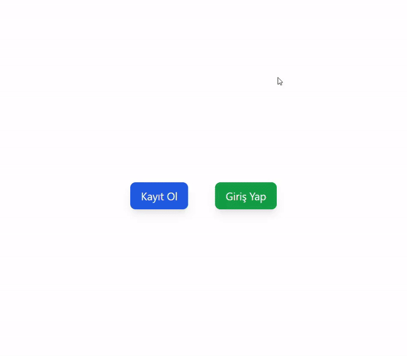

# Firebase Authentication

## Project Description

Firebase Authentication is a web application that allows users to securely authenticate using Firebase. Through this application, users can sign up, log in, and manage their sessions.

## Features

- User registration and login with Firebase
- Global state management with Redux Toolkit
- User feedback via toast notifications
- User-friendly interface and mobile-responsive design

## Used Technologies

- React: UI development
- Redux Toolkit: Global state management
- React Router DOM: Routing
- Firebase: Authentication and user operations
- react-hot-toast: Notifications (toasts)
- React Icons: For icons
- Tailwind CSS: CSS framework for UI styling

## Development

To develop the project, follow these steps:

1. Clone the repository:
   ```bash
   git clone https://github.com/emreertugrl/Firebase_Authentication_App.git
   ```
2. Navigate to the project directory:

   ```bash
   cd Firebase_Authentication_App
   ```

3. Install the dependencies:

   ```bash
   npm install
   ```

4. Start the application:

   ```bash
   npm run dev
   ```

## Visual



## Live Demo

<a href="https://firebaseauthenticationapp.netlify.app/">Netlify Project View</a>

## API'ler

No external APIs were used in this project.

## Contact

For any questions or suggestions, feel free to reach out:

- Email: emreertugrl7@gmail.com
- LinkedIn: [emreertugrul7](https://www.linkedin.com/in/emreertugrul7/)
# Firebase_Authentication_App
